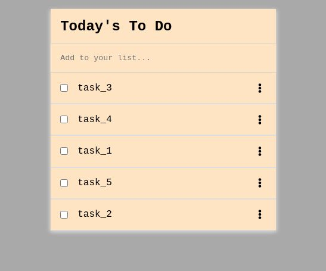

# Project Name

> Todo List project for the Webpack section in Microverse Module 2.

This web app is required to be built using webpack, have an interactive list of task you can add to and remove from. Also, you must be able to drag and drop list items into different positions.

## Built With

- Javascript, CSS, HTML.
- Webpack

## Live Demo

[Live Demo Link Not Yet Available](https://github.com/webdevmaxi)

## Getting Started

To get a local copy up and running follow these simple example steps.

### Usage
- Clone or download the repository.
- Open index.html from the `dist` folder in a browser.

## Authors

👤 **Maximiliano Diaz**

- GitHub: [@webdevmaxi](https://github.com/webdevmaxi)
- LinkedIn: [@mistermaxis](https://linkedin.com/in/linkedinhandle)

## 🤝 Contributing

Contributions, issues, and feature requests are welcome!

Feel free to check the [issues page](../../issues/).

## Show your support

Give a ⭐️ if you like this project!

## Acknowledgments

- Microverse
- Nikos Pountzas: [@pountzas](https://github.com/pountzas)

## 📝 License

This project is [MIT](./MIT.md) licensed.
